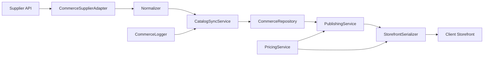

# Ghost Commerce Engine

Ghost Commerce Engine is the reusable supplier-commerce layer proven first inside Bougie & Company. Bougie remains the first implementation site, while the engine owns supplier adapters, normalized catalog data, pricing, inventory sync, publishing, storefront serialization, and future order lifecycle contracts.

## Release Status

Current engine version: `0.2.0-alpha`

Main is tagged at the Phase 1 proof point:

```text
v0.1.0-alpha
```

Phase 1 is complete when production defaults remain dormant:

```env
DROPSHIPPING_ENABLED=false
DROPSHIPPING_CHECKOUT_ENABLED=false
DROPSHIPPING_USE_FIXTURE=false
```

Do not enable dropship checkout until Phase 2 order submission and fulfillment contracts are fully implemented and tested.

## Proven Phase 1 Scope

- Supplier abstraction layer
- Dear-Lover live adapter
- Isolated dropshipping database schema
- Live product, image, variant, inventory, warehouse, and pricing sync
- Admin review workflow
- Product publish and unpublish workflow
- Storefront rendering in `/shop#dropshipping`
- Dropship checkout feature flag kept disabled
- Native Bougie products preserved

## Module Shape

`lib/ghost-commerce-engine` now defines a portable engine boundary:

```text
lib/ghost-commerce-engine/
├── adapters/
│   ├── supplier-adapter.ts
│   └── dear-lover/
│       ├── adapter.ts
│       ├── normalizer.ts
│       ├── transport.ts
│       └── types.ts
├── catalog/
├── core/
├── interfaces/
├── inventory/
├── observability/
├── persistence/
├── pricing/
├── publishing/
├── sync/
└── testing/
```

The live Bougie application still uses the proven Phase 1 helpers. The new engine boundary is intentionally parallel so extraction can continue without destabilizing production behavior.

## Architecture



## Adapter Contract

Adapters expose a supplier-neutral contract:

- `key`
- `displayName`
- `capabilities`
- `testConnection()`
- `searchProducts()`
- `getProduct?()`
- `syncCatalog()`
- `normalizeProduct()`
- `normalizeVariants()`

Dear-Lover-specific fields remain inside `adapters/dear-lover`. The engine domain uses generic `CommerceProduct`, `CommerceVariant`, `CommerceImage`, `CommerceCategory`, and inventory records.

## Repository Contract

The engine depends on `CommerceRepository`, not SQL helpers. The repository owns:

- supplier records
- product and variant upserts
- sync run creation/completion/failure
- publication records
- publish/unpublish state
- published product listing
- optional storefront product listing

`InMemoryCommerceRepository` supports engine tests without PostgreSQL. `BougieCommerceRepository` marks the app integration boundary for the current implementation.

## Application Responsibilities

Each client app owns:

- admin auth
- route handlers
- environment variable binding
- database connection and migrations
- native product behavior
- storefront-specific field names
- deployment platform details
- checkout enablement decisions

The engine should not know what Bougie is, how Bougie authenticates admins, or how Bougie renders components.

## Lifecycle

1. Supplier adapter searches or syncs catalog data.
2. Adapter transport handles HTTP/session details.
3. Adapter normalizer converts raw supplier data into engine products and variants.
4. `CatalogSyncService` records a sync run and upserts products/variants through `CommerceRepository`.
5. Admin/application layer reviews synced products.
6. `PublishingService` imports or updates publication records.
7. `StorefrontSerializer` converts published records into public-safe storefront products.
8. The app maps storefront products into its own UI/API shape.

## Supplier Roadmap

- Dear-Lover
- Bloom Wholesale
- FashionGo
- Faire
- Syncee
- Printful
- Printify
- CJ Dropshipping
- Future suppliers

## Phase 2 Order

1. Order placement to supplier
2. Order status sync
3. Tracking number ingestion and customer visibility
4. Scheduled inventory sync
5. Scheduled price sync
6. Customer order history
7. Returns and cancellations
8. Multi-supplier cart support
9. Bloom Wholesale adapter
10. Additional suppliers

## Phase 2 Contracts Already Defined

- `CommerceOrder`
- `CommerceOrderItem`
- `CommerceAddress`
- `CommerceFulfillment`
- `CommerceTrackingEvent`
- `CommerceOrderStatus`
- `CommerceOrderSubmissionResult`
- `CommerceOrderCapableAdapter`

These contracts are placeholders only. They are not wired into production checkout.

## Current Limitations

- Bougie routes still call the proven `lib/dropshipping/db.ts` helpers directly.
- `BougieCommerceRepository` is a boundary wrapper, not a complete replacement for the current SQL module.
- Admin DTOs are still Bougie-specific.
- Multi-supplier carts and supplier order placement are not implemented.
- No live checkout handoff exists for dropship products.

## Phase 2 Readiness Criteria

- Complete Bougie SQL implementation of `CommerceRepository`.
- Route handlers call engine services through the app integration layer.
- Order submission adapter contract has at least one live supplier implementation.
- Checkout stays disabled until supplier order placement, idempotency, failure handling, and tracking sync pass end-to-end tests.
- Storefront and admin tests verify mixed native plus dropship carts before enablement.

## Guardrails

- Keep supplier-specific parsing inside adapters.
- Keep normalized product, variant, inventory, and pricing contracts supplier-agnostic.
- Keep checkout disabled until supplier order placement is implemented and tested.
- Keep production feature flags off by default.
- Add suppliers behind the adapter registry rather than branching storefront code per supplier.
- Keep engine core free of imports from `app/`, `components/`, Next route handlers, and Bougie integration files.
